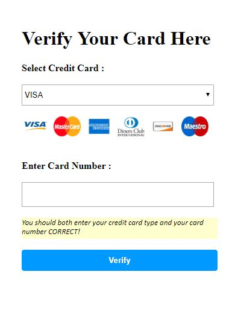
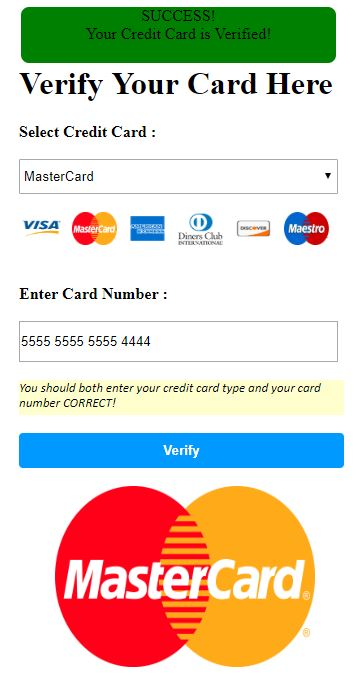

# Verify-Credit-Card

With a few simple Regular Expressions, you can easily verify credit card number and check if its type. Each card issuer has its own range of card numbers. 

There are some common credit card vendor regular expressions:

    Amex Card: ^3[47][0-9]{13}$
    BCGlobal: ^(6541|6556)[0-9]{12}$
    Diners Club Card: ^3(?:0[0-5]|[68][0-9])[0-9]{11}$
    Discover Card: ^65[4-9][0-9]{13}|64[4-9][0-9]{13}|6011[0-9]{12}|(622(?:12[6-9]|1[3-9][0-9]|[2-8][0-9][0-9]|9[01][0-9]|92[0-5])[0-9]{10})$
    Insta Payment Card: ^63[7-9][0-9]{13}$
    JCB Card: ^(?:2131|1800|35\d{3})\d{11}$
    Maestro Card: ^(5018|5020|5038|6304|6759|6761|6763)[0-9]{8,15}$
    Mastercard: ^(5[1-5][0-9]{14}|2(22[1-9][0-9]{12}|2[3-9][0-9]{13}|[3-6][0-9]{14}|7[0-1][0-9]{13}|720[0-9]{12}))$
    Solo Card: ^(6334|6767)[0-9]{12}|(6334|6767)[0-9]{14}|(6334|6767)[0-9]{15}$
    Union Pay Card: ^(62[0-9]{14,17})$
    Visa Card: ^4[0-9]{12}(?:[0-9]{3})?$
    
And here you see screenshots of the asp.net project.

       

